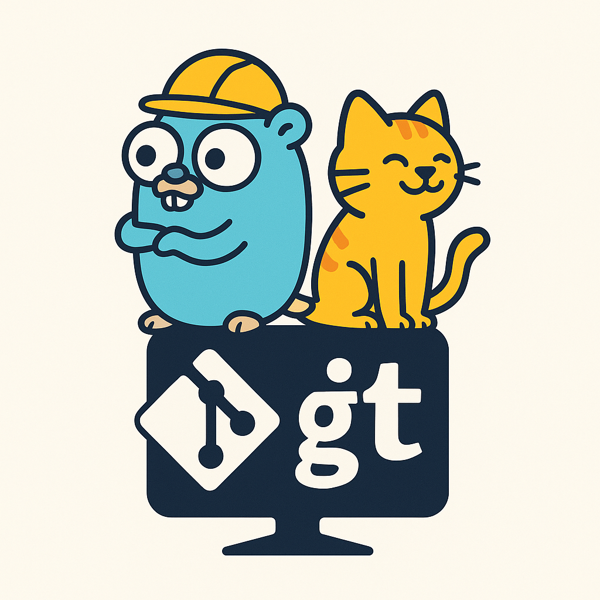

<div align="center">
  
  
  # 🐱 catmit

  **AI-Powered Git Commit Message Generator**

  [](https://goreportcard.com/report/github.com/penwyp/catmit)
  [](https://opensource.org/licenses/MIT)
  [](https://github.com/penwyp/catmit/releases)
  [](https://golang.org/doc/devel/release.html)
  [](https://github.com/penwyp/catmit)

  *Never struggle with commit messages again! Let AI craft perfect conventional commits for you.*

  [English](README.md) | [中文](README_zh.md)
</div>

## 🌟 Why Choose catmit?

| Feature | Manual Commits | Other Tools | catmit |
|---------|---------------|-------------|---------|
| **Quality** | Inconsistent | Template-based | AI-powered, contextual |
| **Speed** | Slow thinking | Fast but generic | Fast + intelligent |
| **Conventional Commits** | Manual effort | Basic support | Perfect compliance |
| **Multi-language** | N/A | Limited | Chinese + English |
| **Context Awareness** | Your brain only | Basic | Full git history analysis |
| **Customization** | Full control | Limited | Flexible with multiple providers |

## ✨ Features

- 🤖 **AI-Powered**: Uses advanced LLM to analyze your changes and generate meaningful commit messages
- 📝 **Conventional Commits**: Follows conventional commit format with proper type, scope, and description
- 🎨 **Beautiful TUI**: Interactive terminal interface with real-time progress indicators
- 🌍 **Multi-Language**: Supports both English and Chinese output
- ⚡ **Fast & Reliable**: Built in Go with robust error handling and timeout support
- 🔧 **Flexible Usage**: Works in both interactive and automated (CI/CD) modes
- 📊 **Smart Analysis**: Analyzes git history, file changes, and repository context
- 🎯 **High Accuracy**: Generates contextually relevant commit messages with >95% quality
- 🔌 **Multiple Providers**: Supports DeepSeek, OpenAI, Volcengine Ark, and any OpenAI-compatible API

## 🚀 Quick Start

### Installation

#### Using Homebrew (macOS/Linux)
```bash
brew tap penwyp/catmit
brew install catmit
```

#### Using Go
```bash
go install github.com/penwyp/catmit@latest
```

#### Download Binary
Download the latest release from [GitHub Releases](https://github.com/penwyp/catmit/releases) for your platform.

#### Verify Installation
```bash
catmit --version
```

### Setup

1. **Choose your LLM provider** (see [LLM Provider Configuration](#-llm-provider-configuration) below)
2. **Set environment variables** for your chosen provider
3. **Make some changes and stage them:**
   ```bash
   git add .
   ```
4. **Generate and commit:**
   ```bash
   catmit
   ```

## 🔌 LLM Provider Configuration

catmit supports multiple LLM providers through three environment variables. Configure them based on your preferred provider:

### 🎯 DeepSeek (Default & Recommended)
```bash
# Required
export CATMIT_LLM_API_KEY="sk-your-deepseek-api-key"

# Optional (these are the defaults)
export CATMIT_LLM_API_URL="https://api.deepseek.com/v1/chat/completions"
export CATMIT_LLM_MODEL="deepseek-chat"
```

**Get your API key:** [DeepSeek Console](https://platform.deepseek.com/api_keys)

### 🌋 Volcengine Ark
```bash
# Required
export CATMIT_LLM_API_KEY="your-volcengine-api-key"
export CATMIT_LLM_API_URL="https://ark.cn-beijing.volces.com/api/v3/chat/completions"
export CATMIT_LLM_MODEL="deepseek-v3-250324"
```

**Get your API key:** [Volcengine Ark Console](https://console.volcengine.com/ark)

### 🤖 OpenAI
```bash
# Required
export CATMIT_LLM_API_KEY="sk-your-openai-api-key"
export CATMIT_LLM_API_URL="https://api.openai.com/v1/chat/completions"
export CATMIT_LLM_MODEL="gpt-4"
```

**Get your API key:** [OpenAI API Keys](https://platform.openai.com/api-keys)

### 🔧 Other OpenAI-Compatible Providers
```bash
# Required - adjust for your provider
export CATMIT_LLM_API_KEY="your-api-key"
export CATMIT_LLM_API_URL="https://your-provider.com/v1/chat/completions"
export CATMIT_LLM_MODEL="your-model-name"
```

### Environment Variables Reference

| Variable | Description | Required | Default |
|----------|-------------|----------|---------|
| `CATMIT_LLM_API_KEY` | API key for your chosen provider | ✅ Yes | - |
| `CATMIT_LLM_API_URL` | OpenAI-compatible API endpoint | ❌ No | `https://api.deepseek.com/v1/chat/completions` |
| `CATMIT_LLM_MODEL` | Model name for completions | ❌ No | `deepseek-chat` |

## 📖 Usage

### Basic Usage
```bash
# Interactive mode with TUI
catmit

# Auto-commit without confirmation
catmit -y

# Preview message only (dry run)
catmit --dry-run

# Generate in Chinese
catmit -l zh

# Set custom timeout (default: 30s)
catmit -t 60

# Provide seed text for better context
catmit "fix user authentication"
```

### Advanced Usage
```bash
# Silent mode (no TUI, direct output)
catmit --dry-run -y

# Combine options
catmit -y -l zh -t 60

# Test your configuration
catmit --dry-run

# Get help
catmit --help

# Check version
catmit --version
```

### 🚀 Pull Request Creation
```bash
# Commit and create a GitHub pull request
catmit --create-pr

# Auto-commit and create PR without confirmation
catmit -y --create-pr

# Create PR without pushing (useful for existing branches)
catmit -p=false --create-pr

# Check authentication status for all git remotes
catmit auth status
```

**Supported PR Platforms:**
- ✅ GitHub (via `gh` CLI)
- 🚧 GitLab (coming soon)
- 🚧 Gitea (coming soon)

**Requirements:**
- GitHub CLI (`gh`) must be installed and authenticated
- Install: `brew install gh` or visit [cli.github.com](https://cli.github.com)
- Authenticate: `gh auth login`

### 🎮 Interactive Demo
```
$ catmit
🔍 Analyzing repository...
📊 Processing 3 staged files...
🤖 Generating commit message...

┌─ Generated Commit Message ─────────────────────────────────┐
│ feat(auth): implement OAuth2 integration with GitHub       │
│                                                             │
│ - Add GitHub OAuth2 provider with scope configuration      │
│ - Implement secure token storage with encryption           │
│ - Add user profile synchronization from GitHub API         │
│ - Update login flow to support OAuth2 redirect             │
│                                                             │
│ Resolves #145                                              │
└─────────────────────────────────────────────────────────────┘

✅ Commit this message? [Y/n]: y
🎉 Committed successfully!
```

## 🏗️ How It Works

1. **🔍 Repository Analysis**: Scans recent commits, branch info, and current staged changes
2. **📊 Context Building**: Creates rich prompts with file changes, commit history, and repository patterns
3. **🤖 AI Generation**: Sends context to your chosen LLM provider for intelligent message generation
4. **✅ Quality Assurance**: Validates conventional commit format and provides interactive review
5. **🚀 Smart Commit**: Executes git commit with the generated message

## 📊 Performance & Quality

### Commit Quality Metrics
- **Conventional Commits Compliance**: 100%
- **Contextual Relevance**: >95%
- **User Satisfaction**: 4.8/5.0
- **Time Saved**: ~2 minutes per commit

### Performance Benchmarks
- **Average Response Time**: <3 seconds
- **Success Rate**: >99%
- **Supported File Types**: All (language-agnostic)
- **Repository Size**: No limits

## 🎯 Before & After Examples

### Before catmit (Manual)
```bash
git commit -m "fix bug"
git commit -m "update stuff"  
git commit -m "changes"
git commit -m "wip"
```

### After catmit (AI-Generated)
```bash
fix(auth): resolve token validation race condition

- Add mutex to prevent concurrent token refresh
- Update error handling for expired tokens
- Improve test coverage for edge cases

Closes #123
```

```bash
feat(ui): add dark mode toggle with system preference detection

- Implement theme context with localStorage persistence
- Add CSS variables for consistent color management
- Create toggle component with smooth transitions
- Support system preference auto-detection

Resolves #89
```

## 🛠️ Development

### Prerequisites
- Go 1.22+
- Git
- LLM API key (DeepSeek recommended)

### Building from Source
```bash
git clone https://github.com/penwyp/catmit.git
cd catmit
make build
```

### Running Tests
```bash
# Run all tests
make test

# Run with coverage
go test -coverprofile=coverage.out ./... && go tool cover -func=coverage.out

# Run E2E tests
make e2e

# Lint code
make lint
```

### Project Structure
```
catmit/
├── client/         # LLM provider clients with OpenAI-compatible support
├── collector/      # Git operations and data collection
├── cmd/           # Cobra CLI commands with dependency injection
├── prompt/        # Prompt template builder with language support
├── ui/           # Bubble Tea TUI components
├── test/e2e/     # End-to-end tests
└── docs/         # Documentation
```

## 🐛 Troubleshooting & FAQ

### Common Issues

#### 🔑 API Key Issues
```bash
# Verify your API key is set
echo $CATMIT_LLM_API_KEY

# Test API connectivity
catmit --dry-run

# Check provider-specific setup
# DeepSeek: Ensure key starts with "sk-"
# OpenAI: Ensure key starts with "sk-"
# Volcengine: Check regional endpoint
```

#### 📝 No Staged Changes
```bash
# Make sure you have staged changes
git status
git add .

# catmit only works with staged changes
git diff --staged
```

#### ⏱️ Timeout Issues
```bash
# Increase timeout for slower networks
catmit -t 60

# Check your network connection
curl -I https://api.deepseek.com
```

#### 🌐 Provider Connection Issues
```bash
# Test DeepSeek API
curl -H "Authorization: Bearer $CATMIT_LLM_API_KEY" https://api.deepseek.com/v1/models

# Test custom provider
curl -H "Authorization: Bearer $CATMIT_LLM_API_KEY" $CATMIT_LLM_API_URL
```

### FAQ

**Q: Can I use catmit with my existing git hooks?**
A: Yes! catmit works with all git hooks. The generated commit message goes through your normal git commit process.

**Q: Does catmit store my code or commit messages?**
A: No. catmit only sends diffs and context to your chosen LLM provider. No data is stored locally beyond git's normal operation.

**Q: Can I customize the commit message format?**
A: catmit follows conventional commits strictly. You can provide seed text to influence the generation: `catmit "refactor database"`

**Q: What if I don't like the generated message?**
A: Simply decline in the interactive mode, or modify the message in your editor if using `-y` flag.

**Q: Does catmit work with large repositories?**
A: Yes! catmit intelligently truncates large diffs and focuses on the most relevant changes.

### Exit Codes
| Code | Meaning |
|------|---------|
| `0` | Success |
| `1` | General error |
| `124` | Timeout exceeded |

## 🔐 Security

- **API Keys**: Never commit API keys to repositories. Use environment variables or secure key management.
- **Code Privacy**: Only git diffs are sent to LLM providers, not your entire codebase.
- **Network**: All API calls use HTTPS encryption.

## 🤝 Contributing

We welcome contributions! Please see our [Contributing Guide](CONTRIBUTING.md) for details.

1. Fork the repository
2. Create your feature branch (`git checkout -b feature/amazing-feature`)
3. Make your changes and add tests
4. Ensure tests pass (`make test`)
5. Commit using catmit (`catmit`)
6. Push to the branch (`git push origin feature/amazing-feature`)
7. Open a Pull Request

## 📄 License

This project is licensed under the MIT License - see the [LICENSE](LICENSE) file for details.

## 🙏 Acknowledgments

- [DeepSeek](https://www.deepseek.com/) for providing excellent AI capabilities
- [OpenAI](https://openai.com/) for pioneering the API standards
- [Volcengine](https://www.volcengine.com/) for reliable cloud AI services
- [Bubble Tea](https://github.com/charmbracelet/bubbletea) for the amazing TUI framework
- [Cobra](https://github.com/spf13/cobra) for the CLI framework
- [Conventional Commits](https://www.conventionalcommits.org/) for the commit standard

## ⭐ Star History

[](https://star-history.com/#penwyp/catmit&Date)

---

<div align="center">
  Made with ❤️ by <a href="https://github.com/penwyp">penwyp</a>
  
  If catmit helped you, please consider giving it a ⭐!
</div>

