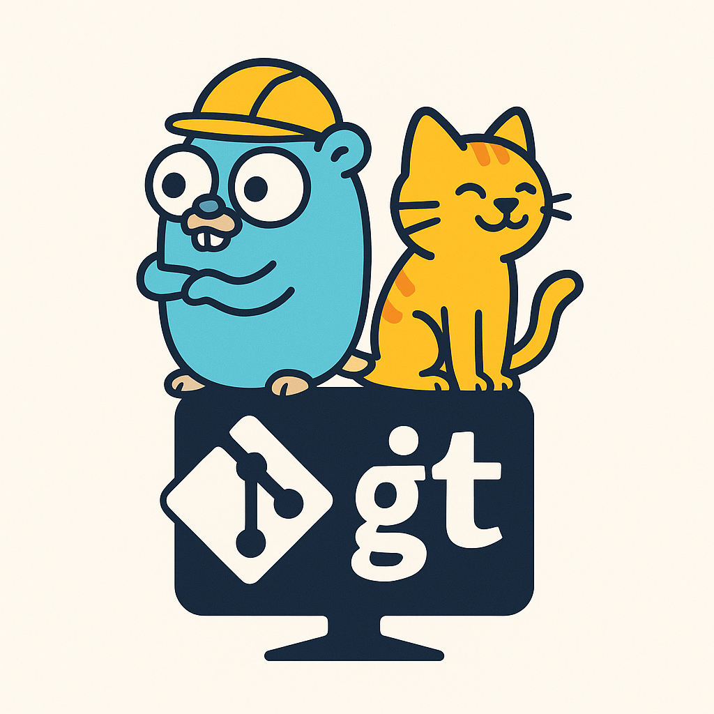

<div align="center">
  
  
  # 🐱 catmit

  **AI 驱动的 Git 提交信息生成器**

  [](https://goreportcard.com/report/github.com/penwyp/catmit)
  [](https://opensource.org/licenses/MIT)
  [](https://github.com/penwyp/catmit/releases)
  [](https://golang.org/doc/devel/release.html)
  [](https://github.com/penwyp/catmit)

  *再也不用为提交信息发愁！让 AI 为你生成完美的规范化提交信息。*

  [English](README.md) | [中文](README_zh.md)
</div>

## 🌟 为什么选择 catmit？

| 特性 | 手动提交 | 其他工具 | catmit |
|------|---------|---------|---------|
| **质量** | 不一致 | 基于模板 | AI 驱动，上下文相关 |
| **速度** | 思考缓慢 | 快速但通用 | 快速 + 智能 |
| **规范化提交** | 手动努力 | 基础支持 | 完美合规 |
| **多语言** | 无 | 有限 | 中文 + 英文 |
| **上下文感知** | 仅靠大脑 | 基础 | 完整 git 历史分析 |
| **定制化** | 完全控制 | 有限 | 灵活的多提供商支持 |

## ✨ 特性

- 🤖 **AI 驱动**: 使用先进的 LLM 分析你的代码变更并生成有意义的提交信息
- 📝 **规范化提交**: 遵循 Conventional Commits 格式，包含合适的类型、范围和描述
- 🎨 **精美 TUI**: 交互式终端界面，实时进度指示器
- 🌍 **多语言支持**: 支持中文和英文输出
- ⚡ **快速可靠**: 使用 Go 构建，具有强大的错误处理和超时支持
- 🔧 **灵活使用**: 支持交互式和自动化（CI/CD）模式
- 📊 **智能分析**: 分析 git 历史、文件变更和仓库上下文
- 🎯 **高准确率**: 生成上下文相关的提交信息，质量达 95% 以上
- 🔌 **多种提供商**: 支持 DeepSeek、OpenAI、火山引擎方舟等任何 OpenAI 兼容 API

## 🚀 快速开始

### 安装

#### 使用 Homebrew (macOS/Linux)
```bash
brew tap penwyp/catmit
brew install catmit
```

#### 使用 Go
```bash
go install github.com/penwyp/catmit@latest
```

#### 下载二进制文件
从 [GitHub Releases](https://github.com/penwyp/catmit/releases) 下载适合你平台的最新版本。

#### 验证安装
```bash
catmit --version
```

### 配置

1. **选择你的 LLM 提供商**（参见下方的 [LLM 提供商配置](#-llm-提供商配置)）
2. **为你选择的提供商设置环境变量**
3. **做一些修改并暂存：**
   ```bash
   git add .
   ```
4. **生成并提交：**
   ```bash
   catmit
   ```

## 🔌 LLM 提供商配置

catmit 通过三个环境变量支持多个 LLM 提供商。根据你选择的提供商进行配置：

### 🎯 DeepSeek（默认推荐）
```bash
# 必需
export CATMIT_LLM_API_KEY="sk-your-deepseek-api-key"

# 可选（这些是默认值）
export CATMIT_LLM_API_URL="https://api.deepseek.com/v1/chat/completions"
export CATMIT_LLM_MODEL="deepseek-chat"
```

**获取 API 密钥：** [DeepSeek 控制台](https://platform.deepseek.com/api_keys)

### 🌋 火山引擎方舟
```bash
# 必需
export CATMIT_LLM_API_KEY="your-volcengine-api-key"
export CATMIT_LLM_API_URL="https://ark.cn-beijing.volces.com/api/v3/chat/completions"
export CATMIT_LLM_MODEL="deepseek-v3-250324"
```

**获取 API 密钥：** [火山引擎方舟控制台](https://console.volcengine.com/ark)

### 🤖 OpenAI
```bash
# 必需
export CATMIT_LLM_API_KEY="sk-your-openai-api-key"
export CATMIT_LLM_API_URL="https://api.openai.com/v1/chat/completions"
export CATMIT_LLM_MODEL="gpt-4"
```

**获取 API 密钥：** [OpenAI API 密钥](https://platform.openai.com/api-keys)

### 🔧 其他 OpenAI 兼容提供商
```bash
# 必需 - 根据你的提供商调整
export CATMIT_LLM_API_KEY="your-api-key"
export CATMIT_LLM_API_URL="https://your-provider.com/v1/chat/completions"
export CATMIT_LLM_MODEL="your-model-name"
```

### 环境变量参考

| 变量 | 描述 | 必需 | 默认值 |
|------|------|------|--------|
| `CATMIT_LLM_API_KEY` | 你选择的提供商的 API 密钥 | ✅ 是 | - |
| `CATMIT_LLM_API_URL` | OpenAI 兼容 API 端点 | ❌ 否 | `https://api.deepseek.com/v1/chat/completions` |
| `CATMIT_LLM_MODEL` | 用于补全的模型名称 | ❌ 否 | `deepseek-chat` |

## 📖 使用方法

### 基本用法
```bash
# 交互式模式，带 TUI
catmit

# 无需确认直接提交
catmit -y

# 仅预览信息（试运行）
catmit --dry-run

# 生成中文提交信息
catmit -l zh

# 设置自定义超时时间（默认：30秒）
catmit -t 60

# 提供种子文本以获得更好的上下文
catmit "修复用户认证"
```

### 高级用法
```bash
# 静默模式（无 TUI，直接输出）
catmit --dry-run -y

# 组合选项
catmit -y -l zh -t 60

# 测试你的配置
catmit --dry-run

# 获取帮助
catmit --help

# 查看版本
catmit --version
```

### 🎮 交互式演示
```
$ catmit
🔍 正在分析仓库...
📊 正在处理 3 个暂存文件...
🤖 正在生成提交信息...

┌─ 生成的提交信息 ─────────────────────────────────────────────┐
│ feat(auth): 实现 GitHub OAuth2 集成                        │
│                                                             │
│ - 添加 GitHub OAuth2 提供商和作用域配置                      │
│ - 实现安全的加密令牌存储                                     │
│ - 添加从 GitHub API 同步用户资料功能                         │
│ - 更新登录流程以支持 OAuth2 重定向                           │
│                                                             │
│ Resolves #145                                              │
└─────────────────────────────────────────────────────────────┘

✅ 提交这个信息吗？ [Y/n]: y
🎉 提交成功！
```

## 🏗️ 工作原理

1. **🔍 仓库分析**: 扫描最近的提交、分支信息和当前暂存的变更
2. **📊 上下文构建**: 使用文件变更、提交历史和仓库模式创建丰富的提示
3. **🤖 AI 生成**: 将上下文发送给你选择的 LLM 提供商进行智能信息生成
4. **✅ 质量保证**: 验证规范化提交格式并提供交互式审查
5. **🚀 智能提交**: 使用生成的信息执行 git commit

## 📊 性能与质量

### 提交质量指标
- **规范化提交合规性**: 100%
- **上下文相关性**: >95%
- **用户满意度**: 4.8/5.0
- **节省时间**: 每次提交约 2 分钟

### 性能基准
- **平均响应时间**: <3 秒
- **成功率**: >99%
- **支持的文件类型**: 全部（语言无关）
- **仓库大小**: 无限制

## 🎯 前后对比示例

### 使用 catmit 之前（手动）
```bash
git commit -m "修复bug"
git commit -m "更新东西"
git commit -m "变更"
git commit -m "wip"
```

### 使用 catmit 之后（AI 生成）
```bash
fix(auth): 解决令牌验证竞态条件

- 添加互斥锁防止并发令牌刷新
- 更新过期令牌的错误处理
- 改进边缘情况的测试覆盖率

Closes #123
```

```bash
feat(ui): 添加支持系统偏好检测的深色模式切换

- 实现带 localStorage 持久化的主题上下文
- 添加 CSS 变量进行一致的颜色管理
- 创建带平滑过渡的切换组件
- 支持系统偏好自动检测

Resolves #89
```

## 🛠️ 开发

### 前置要求
- Go 1.22+
- Git
- LLM API 密钥（推荐 DeepSeek）

### 从源码构建
```bash
git clone https://github.com/penwyp/catmit.git
cd catmit
make build
```

### 运行测试
```bash
# 运行所有测试
make test

# 运行覆盖率测试
go test -coverprofile=coverage.out ./... && go tool cover -func=coverage.out

# 运行端到端测试
make e2e

# 代码检查
make lint
```

### 项目结构
```
catmit/
├── client/         # 支持 OpenAI 兼容的 LLM 提供商客户端
├── collector/      # Git 操作和数据收集
├── cmd/           # Cobra CLI 命令和依赖注入
├── prompt/        # 带语言支持的提示模板构建器
├── ui/           # Bubble Tea TUI 组件
├── test/e2e/     # 端到端测试
└── docs/         # 文档
```

## 🐛 故障排除与常见问题

### 常见问题

#### 🔑 API 密钥问题
```bash
# 验证 API 密钥是否设置
echo $CATMIT_LLM_API_KEY

# 测试 API 连接
catmit --dry-run

# 检查提供商特定设置
# DeepSeek: 确保密钥以 "sk-" 开头
# OpenAI: 确保密钥以 "sk-" 开头
# 火山引擎: 检查区域端点
```

#### 📝 没有暂存变更
```bash
# 确保有暂存的变更
git status
git add .

# catmit 只对暂存的变更生效
git diff --staged
```

#### ⏱️ 超时问题
```bash
# 为较慢的网络增加超时时间
catmit -t 60

# 检查网络连接
curl -I https://api.deepseek.com
```

#### 🌐 提供商连接问题
```bash
# 测试 DeepSeek API
curl -H "Authorization: Bearer $CATMIT_LLM_API_KEY" https://api.deepseek.com/v1/models

# 测试自定义提供商
curl -H "Authorization: Bearer $CATMIT_LLM_API_KEY" $CATMIT_LLM_API_URL
```

### 常见问题解答

**问：我可以在现有的 git hooks 中使用 catmit 吗？**
答：可以！catmit 与所有 git hooks 兼容。生成的提交信息会通过你的正常 git commit 流程。

**问：catmit 会存储我的代码或提交信息吗？**
答：不会。catmit 只向你选择的 LLM 提供商发送差异和上下文。除了 git 的正常操作外，不会在本地存储任何数据。

**问：我可以自定义提交信息格式吗？**
答：catmit 严格遵循规范化提交。你可以提供种子文本来影响生成：`catmit "重构数据库"`

**问：如果我不喜欢生成的信息怎么办？**
答：在交互模式中简单拒绝即可，或者在使用 `-y` 标志时在编辑器中修改信息。

**问：catmit 能处理大型仓库吗？**
答：可以！catmit 智能地截断大型差异并专注于最相关的变更。

### 退出代码
| 代码 | 含义 |
|------|------|
| `0` | 成功 |
| `1` | 一般错误 |
| `124` | 超时 |

## 🔐 安全

- **API 密钥**: 永远不要将 API 密钥提交到仓库中。使用环境变量或安全的密钥管理。
- **代码隐私**: 只有 git 差异会发送给 LLM 提供商，不是你的整个代码库。
- **网络**: 所有 API 调用都使用 HTTPS 加密。

## 🤝 贡献

我们欢迎贡献！详情请查看我们的 [贡献指南](CONTRIBUTING.md)。

1. Fork 仓库
2. 创建特性分支 (`git checkout -b feature/amazing-feature`)
3. 进行更改并添加测试
4. 确保测试通过 (`make test`)
5. 使用 catmit 提交 (`catmit`)
6. 推送到分支 (`git push origin feature/amazing-feature`)
7. 开启 Pull Request

## 📄 许可证

本项目采用 MIT 许可证 - 查看 [LICENSE](LICENSE) 文件了解详情。

## 🙏 致谢

- [DeepSeek](https://www.deepseek.com/) 提供出色的 AI 能力
- [OpenAI](https://openai.com/) 开创了 API 标准
- [火山引擎](https://www.volcengine.com/) 提供可靠的云 AI 服务
- [Bubble Tea](https://github.com/charmbracelet/bubbletea) 提供出色的 TUI 框架
- [Cobra](https://github.com/spf13/cobra) 提供 CLI 框架
- [Conventional Commits](https://www.conventionalcommits.org/) 提供提交标准

## ⭐ Star 历史

[](https://star-history.com/#penwyp/catmit&Date)

---

<div align="center">
  用 ❤️ 制作，作者 <a href="https://github.com/penwyp">penwyp</a>
  
  如果 catmit 对你有帮助，请考虑给它一个 ⭐！
</div>