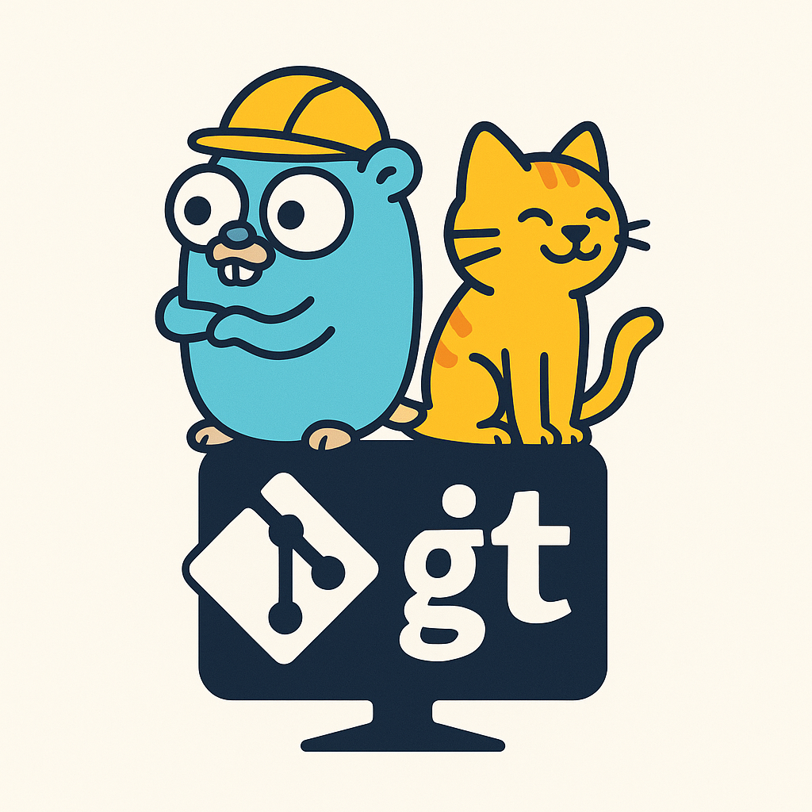

<div align="center">
  
  
  # 🐱 catmit

  **AI 驱动的 Git 提交信息生成器**

  [](https://goreportcard.com/report/github.com/penwyp/catmit)
  [](https://opensource.org/licenses/MIT)
  [](https://github.com/penwyp/catmit/releases)
  [](https://golang.org/doc/devel/release.html)
  [](https://github.com/penwyp/catmit)

  *再也不用为提交信息发愁！让 AI 为你生成完美的规范化提交信息。*

  [English](README.md) | [中文](README_zh.md)
</div>

## 🌟 为什么选择 catmit？

| 特性 | 手动提交 | 其他工具 | catmit |
|------|---------|---------|---------|
| **质量** | 不一致 | 基于模板 | AI 驱动，上下文相关 |
| **速度** | 思考缓慢 | 快速但通用 | 快速 + 智能 |
| **规范化提交** | 手动努力 | 基础支持 | 完美合规 |
| **多语言** | 无 | 有限 | 中文 + 英文 |
| **上下文感知** | 仅靠大脑 | 基础 | 完整 git 历史分析 |
| **定制化** | 完全控制 | 有限 | 灵活的多提供商支持 |

## 特性

- **AI 驱动**: 使用先进的 LLM 分析你的代码变更并生成有意义的提交信息
- **规范化提交**: 遵循 Conventional Commits 格式，包含合适的类型、范围和描述
- **精美 TUI**: 交互式终端界面，实时进度指示器
- **多语言支持**: 支持中文和英文输出
- **快速可靠**: 使用 Go 构建，具有强大的错误处理和超时支持
- **灵活使用**: 支持交互式和自动化（CI/CD）模式
- **智能分析**: 分析 git 历史、文件变更和仓库上下文
- **多种提供商**: 支持 DeepSeek、OpenAI、Azure OpenAI、火山引擎方舟等任何 OpenAI 兼容 API

## 📖 使用方法

### 基本用法
```bash
# 交互式模式，带 TUI
catmit

# 无需确认直接提交
catmit -y

# 仅预览信息（试运行）
catmit --dry-run

# 生成中文提交信息
catmit -l zh

# 设置自定义超时时间（默认：30秒）
catmit -t 60

# 提供种子文本以获得更好的上下文（通过位置参数）
catmit "修复用户认证"

# 或使用 --seed 标志（效果相同）
catmit --seed "修复用户认证"
```

### 高级用法
```bash
# 静默模式（无 TUI，直接输出）
catmit --dry-run -y

# 组合选项
catmit -y -l zh -t 60

# 测试你的配置
catmit --dry-run

# 获取帮助
catmit --help

# 查看版本
catmit --version
```

## 🚀 安装

### 安装方法

#### 使用 Homebrew (macOS/Linux)
```bash
brew tap penwyp/catmit
brew install catmit
```

#### 使用 Go
```bash
go install github.com/penwyp/catmit@latest
```

#### 下载二进制文件
从 [GitHub Releases](https://github.com/penwyp/catmit/releases) 下载适合你平台的最新版本。

#### 验证安装
```bash
catmit --version
```

### 快速配置

1. **选择你的 LLM 提供商**（参见下方的 [LLM 提供商配置](#-llm-提供商配置)）
2. **为你选择的提供商设置环境变量**
3. **做一些修改并暂存：**
   ```bash
   git add .
   ```
4. **生成并提交：**
   ```bash
   catmit
   ```

## 🔌 LLM 提供商配置

catmit 通过三个环境变量支持多个 LLM 提供商。根据你选择的提供商进行配置：

### 🎯 DeepSeek（默认推荐）
```bash
# 必需
export CATMIT_LLM_API_KEY="sk-your-deepseek-api-key"

# 可选（这些是默认值）
export CATMIT_LLM_API_URL="https://api.deepseek.com/v1/chat/completions"
export CATMIT_LLM_MODEL="deepseek-chat"
```

**获取 API 密钥：** [DeepSeek 控制台](https://platform.deepseek.com/api_keys)

### 🌋 火山引擎方舟
```bash
# 必需
export CATMIT_LLM_API_KEY="your-volcengine-api-key"
export CATMIT_LLM_API_URL="https://ark.cn-beijing.volces.com/api/v3/chat/completions"
export CATMIT_LLM_MODEL="deepseek-v3-250324"
```

**获取 API 密钥：** [火山引擎方舟控制台](https://console.volcengine.com/ark)

### 🤖 OpenAI
```bash
# 必需
export CATMIT_LLM_API_KEY="sk-your-openai-api-key"
export CATMIT_LLM_API_URL="https://api.openai.com/v1/chat/completions"
export CATMIT_LLM_MODEL="gpt-4"
```

**获取 API 密钥：** [OpenAI API 密钥](https://platform.openai.com/api-keys)

### ☁️ Azure OpenAI
```bash
# 必需
export CATMIT_LLM_PROVIDER="azure"
export CATMIT_LLM_API_KEY="your-azure-api-key"
export CATMIT_LLM_API_URL="https://your-resource.openai.azure.com"
export CATMIT_LLM_MODEL="your-deployment-name"
```

**设置步骤：**
1. 从 [Azure OpenAI 服务](https://azure.microsoft.com/zh-cn/products/ai-services/openai-service) 获取 API 密钥
2. 将 `your-resource` 替换为你的 Azure OpenAI 资源名称
3. 将 `your-deployment-name` 替换为你的模型部署名称（例如：`gpt-4`、`gpt-35-turbo`）

### 🔧 其他 OpenAI 兼容提供商
```bash
# 必需 - 根据你的提供商调整
export CATMIT_LLM_API_KEY="your-api-key"
export CATMIT_LLM_API_URL="https://your-provider.com/v1/chat/completions"
export CATMIT_LLM_MODEL="your-model-name"
```

### 🖥️ CLI 工具模式（实验性）

catmit 可以使用本地 CLI 工具而不是 API 调用来生成提交信息。这对于已安装 AI 工具或希望使用本地模型的用户很有用。

```bash
# 必需 - 启用 CLI 模式
export CATMIT_LLM_PROVIDER="cli"
export CATMIT_LLM_CLI_TOOL="claude"  # 或使用绝对路径如 /usr/local/bin/claude

# 支持的工具（使用二进制名称或完整路径）：
# - claude（Claude Code CLI）
# - cursor-agent（Cursor Agent CLI）
# - gemini（Gemini CLI）
# - qwen, qwen-code（通义千问 Code）
# - aichat（AIChat 工具）
# - ollama（Ollama 本地模型）

# Ollama 特定配置（可选）
export CATMIT_LLM_MODEL="llama2"  # 可选，默认为 llama2
```

**使用示例：**
```bash
# 使用 Claude Code
export CATMIT_LLM_PROVIDER=cli
export CATMIT_LLM_CLI_TOOL=claude
catmit

# 使用 Cursor Agent
export CATMIT_LLM_PROVIDER=cli
export CATMIT_LLM_CLI_TOOL=cursor-agent
catmit --timeout 60

# 使用 Gemini CLI
export CATMIT_LLM_PROVIDER=cli
export CATMIT_LLM_CLI_TOOL=gemini
catmit
```

**重要说明：**
- **无降级机制**：如果 CLI 工具失败，catmit 将退出（不会自动回退到 API）
- **用户控制**：必须显式设置两个环境变量
- **工具验证**：catmit 启动时会验证工具是否存在且可执行
- **认证**：CLI 工具使用自己的认证方式（无需 API 密钥）
- **超时时间**：某些 CLI 工具可能需要比默认的 20 秒更长的超时时间

### 环境变量参考

| 变量 | 描述 | 必需 | 默认值 |
|------|------|------|--------|
| `CATMIT_LLM_PROVIDER` | LLM 提供商类型（`azure`、`cli` 或留空使用 OpenAI 兼容） | ❌ 否 | OpenAI 兼容 |
| `CATMIT_LLM_API_KEY` | 你选择的提供商的 API 密钥（CLI 模式不需要） | ✅ 是* | - |
| `CATMIT_LLM_API_URL` | API 端点（OpenAI 兼容为完整 URL，Azure 为基础 URL） | ❌ 否 | `https://api.deepseek.com/v1/chat/completions` |
| `CATMIT_LLM_MODEL` | 模型名称（OpenAI 兼容）或部署名称（Azure） | ❌ 否 | `deepseek-chat` |
| `CATMIT_LLM_CLI_TOOL` | CLI 工具名称或路径（仅 CLI 模式） | ✅ 是** | - |

*仅 API 模式需要  
**仅 CLI 模式需要

### 提供商映射配置

catmit 通过配置文件自动检测 git 托管提供商。默认配置将常见的 git 主机映射到其对应平台：

**配置文件位置**: `~/.config/catmit/providers.yaml`

此文件在首次运行时自动创建，包含默认映射。你可以自定义它以添加自己的 git 托管服务：

```yaml
# 默认提供商映射
hosts:
  github.com: github
  gitlab.com: gitlab
  bitbucket.org: bitbucket
  # 添加自定义企业主机
  git.company.com: github    # GitHub 企业版
  gitlab.internal.com: gitlab # GitLab 自托管
```

**功能特性**：
- 🔍 基于 git 远程 URL 自动检测 PR 提供商
- 🔄 热重载：更改立即生效，无需重启
- 🏢 企业支持：将内部 git 主机映射到支持的提供商
- 🎯 需要时可使用 `--pr-provider` 标志覆盖

## 📖 使用方法

### 基本用法
```bash
# 交互式模式，带 TUI
catmit

# 无需确认直接提交
catmit -y

# 仅预览信息（试运行）
catmit --dry-run

# 生成中文提交信息
catmit -l zh

# 设置自定义超时时间（默认：30秒）
catmit -t 60

# 提供种子文本以获得更好的上下文（通过位置参数）
catmit "修复用户认证"

# 或使用 --seed 标志（效果相同）
catmit --seed "修复用户认证"
```

### 高级用法
```bash
# 静默模式（无 TUI，直接输出）
catmit --dry-run -y

# 组合选项
catmit -y -l zh -t 60

# 测试你的配置
catmit --dry-run

# 获取帮助
catmit --help

# 查看版本
catmit --version
```

### 🔀 合并提交信息

#### 编辑器模式（草稿信息）
```bash
# 将多个提交信息合并为一个（打开编辑器）
catmit squash-draft

# 跳过确认，直接输出
catmit squash-draft --yes

# 生成中文提交信息
catmit squash-draft --lang zh

# 自定义超时时间
catmit squash-draft --timeout 60

# 预览模式，不复制到剪贴板
catmit squash-draft --dry-run

# 示例工作流：
$ catmit squash-draft
# 打开默认编辑器输入提交信息
# 每行一个提交信息，保存并退出

# 生成的结果（自动复制到剪贴板）：
feat: 实现完整的认证系统

- 添加基于 JWT 的用户认证功能
- 修复移动端登录错误
- 更新认证相关文档

✓ 已复制到剪贴板
```

#### 历史模式（合并未推送的提交）
```bash
# 使用交互式变基合并未推送的提交
catmit squash-history

# 跳过确认（自动确认）
catmit squash-history --yes

# 生成中文提交信息
catmit squash-history --lang zh

# 自定义超时时间
catmit squash-history --timeout 60

# 示例工作流：
$ catmit squash-history
# 分析未推送的提交
# 使用 AI 生成合并的提交信息
# 执行交互式变基并创建备份分支
# ✓ 变基完成成功
# 备份分支：backup-feature-branch-20250122-123456
```

**合并历史功能：**
- 🔄 **智能分析**：自动检测未推送的提交
- 🧠 **AI 生成信息**：从多个提交中创建有意义的提交信息
- 🛡️ **安全第一**：在进行更改前创建备份分支
- 🎯 **TUI 界面**：交互式终端界面用于确认和监控
- ⚡ **基础分支检测**：自动检测 main/master 作为基础分支

### 🚀 Pull Request 创建
```bash
# 创建带有 AI 生成描述的 pull request
catmit pr

# 创建草稿 PR
catmit pr --draft

# 指定远程仓库和基础分支
catmit pr --remote upstream --base develop

# 跳过模板使用
catmit pr --template=false

# 检查所有 git 远程仓库的认证状态
catmit check-auth
```

**支持的 PR 平台：**
- ✅ GitHub（通过 `gh` CLI）
- ✅ GitLab（通过 `glab` CLI）
- ✅ Gitea（通过 `tea` CLI）

**要求：**
- GitHub：必须安装并认证 `gh` CLI
  - 安装：`brew install gh` 或访问 [cli.github.com](https://cli.github.com)
  - 认证：`gh auth login`
- GitLab：必须安装并认证 `glab` CLI
  - 安装：`brew install glab` 或访问 [gitlab.com/gitlab-org/cli](https://gitlab.com/gitlab-org/cli)
  - 认证：`glab auth login`
- Gitea：必须安装并认证 `tea` CLI
  - 安装：`brew install tea` 或访问 [gitea.com/gitea/tea](https://gitea.com/gitea/tea)
  - 认证：`tea login add`

### 📝 PR 模板支持

catmit 支持仓库模板和自定义配置模板：

**仓库模板位置**（自动检测）：
1. `.github/pull_request_template.md`
2. `.github/PULL_REQUEST_TEMPLATE.md`
3. `docs/pull_request_template.md`
4. `PULL_REQUEST_TEMPLATE.md`

**自定义模板支持**：
catmit 会自动从标准仓库位置（`.github/pull_request_template.md` 等）检测 PR 模板并在创建拉取请求时使用。

**功能特性**：
- 🎯 自动检测 PR 模板文件
- 📋 模板变量替换：
  - `{{.CommitMessage}}` - 生成的提交信息
  - `{{.Branch}}` - 当前分支名
  - `{{.BaseBranch}}` - 目标基础分支
  - `{{.Date}}` - 当前日期
- 🔧 如需禁用可使用 `--pr-template=false`

**模板示例**：
```markdown
## 描述
{{.CommitMessage}}

## 变更类型
- [ ] Bug 修复
- [ ] 新功能
- [ ] 破坏性变更

## 测试
- [ ] 本地测试通过
- [ ] 已添加新测试

分支：{{.Branch}} → {{.BaseBranch}}
```

### 🔧 高级 PR 选项

catmit 提供对拉取请求创建的全面控制：

**所有 PR 标志：**
```bash
# 使用所有选项创建 PR
catmit pr \
  --remote upstream \
  --base develop \
  --draft \
  --provider github

# 先生成提交信息，然后创建 PR
catmit --yes  # 使用 AI 生成的信息提交
catmit pr     # 为已提交的更改创建 PR
```

**Fork 工作流支持：**
```bash
# 在 fork 上工作？推送到 origin 并创建 PR 到 upstream
git remote -v  # origin（你的 fork），upstream（原始仓库）
catmit pr --remote upstream

# 或使用简写
catmit pr -r upstream
```

**多远程场景：**
```bash
# 列出所有远程仓库及其提供商
catmit check-auth

# 创建 PR 到特定远程
catmit pr --remote company

# 为已存在的分支创建 PR
catmit pr  # 如果分支已存在，将创建 PR 而不推送
```

**提供商检测：**
- 从 git 远程 URL 自动检测
- 通过 `~/.config/catmit/providers.yaml` 映射自定义主机
- 需要时使用 `--provider` 覆盖
- 支持 GitHub 企业版和自托管 GitLab

### 🎮 交互式演示
```
$ catmit
🔍 正在分析仓库...
📊 正在处理 3 个暂存文件...
🤖 正在生成提交信息...

┌─ 生成的提交信息 ─────────────────────────────────────────────┐
│ feat(auth): 实现 GitHub OAuth2 集成                        │
│                                                             │
│ - 添加 GitHub OAuth2 提供商和作用域配置                      │
│ - 实现安全的加密令牌存储                                     │
│ - 添加从 GitHub API 同步用户资料功能                         │
│ - 更新登录流程以支持 OAuth2 重定向                           │
│                                                             │
│ Resolves #145                                              │
└─────────────────────────────────────────────────────────────┘

✅ 提交这个信息吗？ [Y/n]: y
🎉 提交成功！
```

## 🏗️ 工作原理

1. **🔍 仓库分析**: 扫描最近的提交、分支信息和当前暂存的变更
2. **📊 智能上下文构建**: 
   - 基于变更重要性的智能文件优先级排序
   - 大型差异的 Token 预算管理
   - 未跟踪文件分析和包含
   - 并发 Git 操作优化性能
3. **🤖 AI 生成**: 将优化后的上下文发送给你选择的 LLM 提供商进行智能信息生成
4. **✅ 质量保证**: 验证规范化提交格式并提供交互式审查
5. **🚀 智能提交**: 使用生成的信息执行 git commit

### 🎯 高级特性

**智能变更分析：**
- **文件优先级评分**：自动优先处理重要文件（配置、主文件、测试）而非次要文件
- **Token 预算管理**：智能截断大型差异以适应 LLM 上下文限制，同时保留关键信息
- **未跟踪文件支持**：在分析中包含新文件以生成全面的提交信息
- **变更规模检测**：将变更分类为小型/中型/大型以指导提交信息详细程度
- **建议提交前缀**：AI 根据变更建议适当的规范化提交类型（feat/fix/docs/refactor）

## 🎯 前后对比示例

### 使用 catmit 之前（手动）
```bash
git commit -m "修复bug"
git commit -m "更新东西"
git commit -m "变更"
git commit -m "wip"
```

### 使用 catmit 之后（AI 生成）
```bash
fix(auth): 解决令牌验证竞态条件

- 添加互斥锁防止并发令牌刷新
- 更新过期令牌的错误处理
- 改进边缘情况的测试覆盖率

Closes #123
```

```bash
feat(ui): 添加支持系统偏好检测的深色模式切换

- 实现带 localStorage 持久化的主题上下文
- 添加 CSS 变量进行一致的颜色管理
- 创建带平滑过渡的切换组件
- 支持系统偏好自动检测

Resolves #89
```

## 🛠️ 开发

### 前置要求
- Go 1.22+
- Git
- LLM API 密钥（推荐 DeepSeek）

### 从源码构建
```bash
git clone https://github.com/penwyp/catmit.git
cd catmit
make build
```

### 运行测试
```bash
# 运行所有测试
make test

# 运行覆盖率测试
go test -coverprofile=coverage.out ./... && go tool cover -func=coverage.out

# 运行端到端测试
make e2e

# 代码检查
make lint
```

### 项目结构
```
catmit/
├── pkg/           # 公共包
│   ├── gitinfo/   # Git 操作和数据收集
│   ├── llm/       # LLM 提供商客户端，支持 OpenAI 兼容
│   └── prompt/    # 提示模板构建器，支持多语言
├── internal/      # 内部包
│   ├── app/       # 应用程序依赖和提供者
│   ├── cli/       # CLI 工具检测和管理
│   ├── config/    # YAML 配置管理
│   ├── errors/    # 自定义错误类型
│   ├── git/       # Git 操作（提交、推送、暂存）
│   ├── pr/        # Pull request 创建逻辑
│   ├── provider/  # Git 提供商检测（GitHub、GitLab）
│   ├── squash/    # 提交压缩功能
│   ├── template/  # PR 模板管理
│   ├── ui/        # Bubble Tea TUI 组件
│   └── workflow/  # 工作流编排
├── cmd/           # Cobra CLI 命令
├── test/e2e/      # 端到端测试
└── docs/          # 文档
```

## 🔐 安全

- **API 密钥**: 永远不要将 API 密钥提交到仓库中。使用环境变量或安全的密钥管理。
- **代码隐私**: 只有 git 差异会发送给 LLM 提供商，不是你的整个代码库。
- **网络**: 所有 API 调用都使用 HTTPS 加密。

## 🤝 贡献

我们欢迎贡献！详情请查看我们的 [贡献指南](CONTRIBUTING.md)。

1. Fork 仓库
2. 创建特性分支 (`git checkout -b feature/amazing-feature`)
3. 进行更改并添加测试
4. 确保测试通过 (`make test`)
5. 使用 catmit 提交 (`catmit`)
6. 推送到分支 (`git push origin feature/amazing-feature`)
7. 开启 Pull Request

## 📄 许可证

本项目采用 MIT 许可证 - 查看 [LICENSE](LICENSE) 文件了解详情。

## 🙏 致谢

- [DeepSeek](https://www.deepseek.com/) 提供出色的 AI 能力
- [OpenAI](https://openai.com/) 开创了 API 标准
- [火山引擎](https://www.volcengine.com/) 提供可靠的云 AI 服务
- [Bubble Tea](https://github.com/charmbracelet/bubbletea) 提供出色的 TUI 框架
- [Cobra](https://github.com/spf13/cobra) 提供 CLI 框架
- [Conventional Commits](https://www.conventionalcommits.org/) 提供提交标准

---

<div align="center">
  用 ❤️ 制作，作者 <a href="https://github.com/penwyp">penwyp</a>
  
  如果 catmit 对你有帮助，请考虑给它一个 ⭐！
</div>