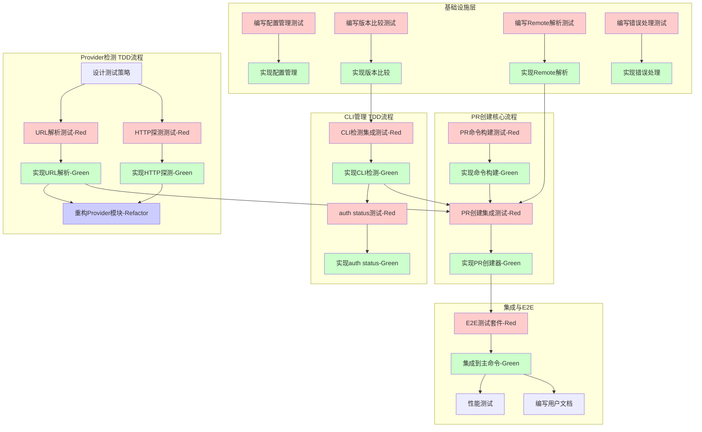

# catmit PR功能 TDD开发计划

**版本**: v1.0  
**生成日期**: 2025-01-17  
**基于文档**: prd-pr.md v2.0

---

## 第二部分：测试策略概览

### 测试金字塔设计
```
         /\
        /E2E\      (10%) - 端到端测试：完整的PR创建流程
       /------\
      /  集成  \    (30%) - 集成测试：模块间交互、CLI调用
     /----------\
    /   单元测试   \  (60%) - 单元测试：核心逻辑、工具函数
   /--------------\
```

### 测试框架选择
- **单元测试**: Go标准测试框架 + testify/assert + gomock
- **集成测试**: Go测试框架 + 自定义test helpers
- **E2E测试**: Go测试框架 + 真实Git仓库环境
- **Mock工具**: gomock (接口mock), httpmock (HTTP请求mock)

### 测试覆盖率目标
- **整体覆盖率**: ≥ 80%
- **核心模块覆盖率**:
  - Provider检测: ≥ 90%
  - CLI版本管理: ≥ 85%
  - PR创建逻辑: ≥ 85%
  - 配置管理: ≥ 80%

### 关键测试场景
1. **Provider自动检测全流程**（含各种URL格式）
2. **CLI工具状态检查**（已安装/未安装/版本过低）
3. **PR创建成功路径**（GitHub/Gitea）
4. **错误处理路径**（网络错误/认证失败/PR已存在）
5. **配置文件生命周期**（创建/读取/更新）

---

## 第三部分：TDD结构化任务列表 (任务总览)

| 任务ID | 任务名称 | 所属功能/模块 | 任务类型 | TDD阶段 | 任务描述 | 完成标准/验证方法 | 前置依赖 | 预期输出/交付物 | 复杂度 | 测试覆盖要求 |
|--------|----------|---------------|----------|----------|----------|-------------------|----------|-----------------|--------|--------------|
| TEST-DESIGN-001 | 设计Provider检测测试策略 | Provider检测 | Test-Design | N/A | 设计覆盖所有Provider检测场景的测试用例 | 测试用例文档完成，覆盖所有检测路径 | - | docs/test-design/provider-detection.md | M | N/A |
| TEST-001 | 编写Provider URL解析单元测试 | Provider检测 | Test-Implementation | Red | 测试解析各种格式的git remote URL | 所有测试用例编写完成且失败 | TEST-DESIGN-001 | provider/detector_test.go | M | 95% |
| IMPL-001 | 实现Provider URL解析功能 | Provider检测 | Feature-Implementation | Green | 实现支持HTTPS/SSH/带端口的URL解析 | TEST-001所有测试通过 | TEST-001 | provider/detector.go | M | - |
| TEST-002 | 编写Provider HTTP探测单元测试 | Provider检测 | Test-Implementation | Red | 测试HTTP探测（含重试机制）的各种场景 | 测试覆盖成功、失败、超时、重试 | TEST-DESIGN-001 | provider/http_probe_test.go | L | 90% |
| IMPL-002 | 实现Provider HTTP探测功能 | Provider检测 | Feature-Implementation | Green | 实现带指数退避的3次重试HTTP探测 | TEST-002所有测试通过 | TEST-002 | provider/http_probe.go | L | - |
| TEST-003 | 编写配置文件管理单元测试 | 配置管理 | Test-Implementation | Red | 测试配置文件创建、读取、原子写入 | 包含并发写入测试 | - | config/manager_test.go | M | 85% |
| IMPL-003 | 实现配置文件管理器 | 配置管理 | Feature-Implementation | Green | 实现带文件锁的原子配置文件操作 | TEST-003所有测试通过 | TEST-003 | config/manager.go | M | - |
| TEST-004 | 编写CLI版本比较单元测试 | CLI管理 | Test-Implementation | Red | 测试语义化版本比较逻辑 | 覆盖标准版本、预发布版本等格式 | - | cli/version_test.go | S | 90% |
| IMPL-004 | 实现CLI版本比较功能 | CLI管理 | Feature-Implementation | Green | 实现语义化版本（semver）比较 | TEST-004所有测试通过 | TEST-004 | cli/version.go | S | - |
| TEST-005 | 编写CLI检测集成测试 | CLI管理 | Test-Implementation | Red | 测试CLI工具的安装、版本、认证状态检测 | 模拟各种CLI状态场景 | IMPL-004 | cli/detector_test.go | M | 85% |
| IMPL-005 | 实现CLI检测器 | CLI管理 | Feature-Implementation | Green | 实现CLI工具状态检测功能 | TEST-005所有测试通过 | TEST-005 | cli/detector.go | M | - |
| TEST-006 | 编写PR命令构建单元测试 | PR创建 | Test-Implementation | Red | 测试GitHub/Gitea的PR命令生成 | 覆盖所有参数组合 | - | pr/command_builder_test.go | M | 90% |
| IMPL-006 | 实现PR命令构建器 | PR创建 | Feature-Implementation | Green | 实现不同Provider的命令模板填充 | TEST-006所有测试通过 | TEST-006 | pr/command_builder.go | M | - |
| TEST-007 | 编写Remote解析单元测试 | Git操作 | Test-Implementation | Red | 测试remote选择逻辑（origin优先） | 覆盖有/无origin、用户指定等场景 | - | git/remote_test.go | S | 95% |
| IMPL-007 | 实现Remote解析功能 | Git操作 | Feature-Implementation | Green | 实现智能remote选择逻辑 | TEST-007所有测试通过 | TEST-007 | git/remote.go | S | - |
| TEST-008 | 编写auth status命令单元测试 | Auth命令 | Test-Implementation | Red | 测试auth status命令的输出格式 | 验证表格输出正确性 | IMPL-005 | cmd/auth_status_test.go | M | 80% |
| IMPL-008 | 实现auth status命令 | Auth命令 | Feature-Implementation | Green | 实现认证状态检查和表格输出 | TEST-008所有测试通过 | TEST-008 | cmd/auth_status.go | M | - |
| TEST-009 | 编写PR创建流程集成测试 | PR创建 | Test-Implementation | Red | 测试完整的PR创建流程 | 模拟CLI调用和错误处理 | IMPL-001,IMPL-005,IMPL-006 | pr/creator_test.go | L | 85% |
| IMPL-009 | 实现PR创建器 | PR创建 | Feature-Implementation | Green | 整合各模块实现PR创建主流程 | TEST-009所有测试通过 | TEST-009 | pr/creator.go | L | - |
| TEST-010 | 编写错误处理单元测试 | 错误处理 | Test-Implementation | Red | 测试各种错误场景的用户提示 | 验证错误信息友好性和准确性 | - | errors/handler_test.go | M | 85% |
| IMPL-010 | 实现统一错误处理 | 错误处理 | Feature-Implementation | Green | 实现友好的错误提示和建议 | TEST-010所有测试通过 | TEST-010 | errors/handler.go | M | - |
| REF-001 | 重构Provider检测模块 | Provider检测 | Refactoring | Refactor | 提取通用检测接口，优化代码结构 | 所有相关测试保持通过 | IMPL-001,IMPL-002 | provider包重构 | M | - |
| TEST-011 | 编写E2E测试套件 | E2E测试 | Test-Implementation | Red | 编写端到端测试覆盖主要用户场景 | 在真实Git环境中测试 | IMPL-009 | test/e2e/pr_test.go | XL | 70% |
| IMPL-011 | 集成PR功能到主命令 | 命令集成 | Feature-Implementation | Green | 将PR功能集成到root command | E2E测试通过 | TEST-011,IMPL-009 | cmd/root.go更新 | M | - |
| TEST-012 | 编写性能测试 | 性能测试 | Test-Implementation | N/A | 测试Provider检测的响应时间 | HTTP探测<3秒（含重试） | IMPL-002 | provider/detector_bench_test.go | S | N/A |
| DOC-001 | 编写用户文档 | 文档 | Docs | N/A | 编写PR功能使用说明和示例 | 文档完整清晰 | IMPL-011 | README.md更新 | S | N/A |

---

## 第四部分：详细任务定义 (JSON数组)

```json
[
  {
    "task_id": "TEST-001",
    "module": "Provider检测",
    "description": "编写Provider URL解析的单元测试",
    "task_type": "Test-Implementation",
    "tdd_phase": "Red",
    "dependencies": ["TEST-DESIGN-001"],
    "complexity": "M",
    "deliverables": ["provider/detector_test.go"],
    "test_spec": {
      "test_framework": "go test + testify",
      "test_cases": [
        {
          "name": "TestParseGitHubHTTPS",
          "input": "https://github.com/owner/repo.git",
          "expected_output": {"provider": "github", "host": "github.com", "owner": "owner", "repo": "repo"},
          "description": "解析标准GitHub HTTPS URL"
        },
        {
          "name": "TestParseGitHubSSH",
          "input": "git@github.com:owner/repo.git",
          "expected_output": {"provider": "github", "host": "github.com", "owner": "owner", "repo": "repo"},
          "description": "解析GitHub SSH URL"
        },
        {
          "name": "TestParseGiteaWithPort",
          "input": "ssh://git@gitea.company.com:2222/owner/repo.git",
          "expected_output": {"provider": "gitea", "host": "gitea.company.com", "owner": "owner", "repo": "repo"},
          "description": "解析带端口的Gitea URL"
        },
        {
          "name": "TestParseUnknownProvider",
          "input": "https://git.unknown.com/owner/repo.git",
          "expected_output": {"provider": "unknown", "host": "git.unknown.com"},
          "description": "未知Provider的处理"
        }
      ],
      "coverage_target": 95
    },
    "verification": {
      "method": "自动化测试执行",
      "criteria": "所有测试用例失败（功能未实现）",
      "command": "go test ./provider -run TestParse -v"
    },
    "notes": "确保覆盖所有URL格式变体"
  },
  {
    "task_id": "IMPL-002",
    "module": "Provider检测",
    "description": "实现带重试机制的HTTP探测功能",
    "task_type": "Feature-Implementation",
    "tdd_phase": "Green",
    "dependencies": ["TEST-002"],
    "complexity": "L",
    "deliverables": ["provider/http_probe.go"],
    "spec": {
      "retry_count": 3,
      "retry_strategy": "指数退避",
      "base_delay": "1s",
      "max_delay": "4s",
      "timeout_per_request": "3s"
    },
    "verification": {
      "method": "单元测试通过",
      "criteria": "TEST-002中所有测试必须通过",
      "command": "go test ./provider -run TestHTTPProbe -v"
    },
    "notes": "使用context实现超时控制，确保总时间不超过设定值"
  },
  {
    "task_id": "TEST-003",
    "module": "配置管理",
    "description": "编写配置文件原子操作的测试",
    "task_type": "Test-Implementation", 
    "tdd_phase": "Red",
    "dependencies": [],
    "complexity": "M",
    "deliverables": ["config/manager_test.go"],
    "test_spec": {
      "test_framework": "go test",
      "test_cases": [
        {
          "name": "TestAtomicWrite",
          "description": "测试原子写入防止部分写入"
        },
        {
          "name": "TestConcurrentWrite",
          "description": "测试并发写入的文件锁保护"
        },
        {
          "name": "TestCreateDefaultConfig",
          "description": "测试首次创建默认配置文件"
        },
        {
          "name": "TestReadCorruptedConfig",
          "description": "测试读取损坏配置的错误处理"
        }
      ],
      "coverage_target": 85
    },
    "verification": {
      "method": "自动化测试",
      "criteria": "测试编写完成且全部失败",
      "command": "go test ./config -v"
    },
    "notes": "使用临时目录进行文件操作测试"
  },
  {
    "task_id": "TEST-004",
    "module": "CLI管理",
    "description": "编写语义化版本比较的单元测试",
    "task_type": "Test-Implementation",
    "tdd_phase": "Red",
    "dependencies": [],
    "complexity": "S",
    "deliverables": ["cli/version_test.go"],
    "test_spec": {
      "test_framework": "go test",
      "test_cases": [
        {
          "name": "TestCompareStandardVersions",
          "input": ["2.0.0", "1.9.9"],
          "expected_output": 1,
          "description": "标准版本比较"
        },
        {
          "name": "TestCompareWithPreRelease",
          "input": ["2.0.0-beta.1", "2.0.0"],
          "expected_output": -1,
          "description": "预发布版本低于正式版本"
        },
        {
          "name": "TestCompareWithBuildMetadata",
          "input": ["2.0.0+build123", "2.0.0+build456"],
          "expected_output": 0,
          "description": "构建元数据不影响版本比较"
        }
      ],
      "coverage_target": 90
    },
    "verification": {
      "method": "单元测试",
      "criteria": "所有比较场景的测试失败",
      "command": "go test ./cli -run TestCompare -v"
    },
    "notes": "参考semver规范实现"
  },
  {
    "task_id": "TEST-007",
    "module": "Git操作",
    "description": "编写Remote选择逻辑的单元测试",
    "task_type": "Test-Implementation",
    "tdd_phase": "Red",
    "dependencies": [],
    "complexity": "S",
    "deliverables": ["git/remote_test.go"],
    "test_spec": {
      "test_framework": "go test + gomock",
      "test_cases": [
        {
          "name": "TestDefaultOriginRemote",
          "scenario": "未指定remote且存在origin",
          "expected": "使用origin",
          "description": "默认使用origin remote"
        },
        {
          "name": "TestNoOriginError", 
          "scenario": "未指定remote且不存在origin",
          "expected": "返回错误",
          "description": "无origin时报错退出"
        },
        {
          "name": "TestUserSpecifiedRemote",
          "scenario": "用户指定--pr-remote=upstream",
          "expected": "使用upstream",
          "description": "优先使用用户指定的remote"
        },
        {
          "name": "TestInvalidRemote",
          "scenario": "用户指定不存在的remote",
          "expected": "返回错误",
          "description": "指定的remote不存在时报错"
        }
      ],
      "coverage_target": 95
    },
    "verification": {
      "method": "单元测试",
      "criteria": "所有测试失败",
      "command": "go test ./git -run TestRemote -v"
    },
    "notes": "Mock git命令输出"
  },
  {
    "task_id": "IMPL-009",
    "module": "PR创建",
    "description": "实现PR创建主流程",
    "task_type": "Feature-Implementation",
    "tdd_phase": "Green",
    "dependencies": ["TEST-009"],
    "complexity": "L",
    "deliverables": ["pr/creator.go"],
    "spec": {
      "main_flow": [
        "解析provider信息",
        "检查CLI工具状态",
        "获取commit信息作为PR内容",
        "构建CLI命令",
        "执行命令并解析输出",
        "处理错误和特殊情况"
      ],
      "error_handling": {
        "pr_exists": "显示已存在的PR链接",
        "cli_not_found": "显示安装指南",
        "auth_failed": "提示运行auth命令",
        "push_not_done": "终端显示'已push但未创建PR'"
      }
    },
    "verification": {
      "method": "集成测试通过",
      "criteria": "TEST-009所有场景通过",
      "command": "go test ./pr -run TestCreate -v"
    },
    "notes": "确保错误信息友好且可操作"
  },
  {
    "task_id": "TEST-011",
    "module": "E2E测试",
    "description": "编写端到端测试套件",
    "task_type": "Test-Implementation",
    "tdd_phase": "Red",
    "dependencies": ["IMPL-009"],
    "complexity": "XL",
    "deliverables": ["test/e2e/pr_test.go", "test/e2e/helpers.go"],
    "test_spec": {
      "test_framework": "go test + 真实git环境",
      "test_scenarios": [
        {
          "name": "TestFullFlowGitHub",
          "description": "完整的commit->push->PR流程(GitHub)"
        },
        {
          "name": "TestFullFlowGitea",
          "description": "完整的commit->push->PR流程(Gitea)"
        },
        {
          "name": "TestPROnly",
          "description": "仅创建PR（已有commit和push）"
        },
        {
          "name": "TestAuthStatusCommand",
          "description": "auth status命令的完整测试"
        }
      ],
      "coverage_target": 70
    },
    "verification": {
      "method": "E2E测试执行",
      "criteria": "在隔离的Git环境中运行",
      "command": "go test ./test/e2e -tags=e2e -v"
    },
    "notes": "需要配置测试用的Git仓库和认证信息"
  }
]
```

---

## 第五部分：TDD任务依赖关系图



---

## TDD实施要点

1. **严格的Red-Green-Refactor循环**
   - 每个功能必须先写失败的测试
   - 只写使测试通过的最小代码
   - 在测试保护下进行重构

2. **测试独立性保证**
   - 使用test fixtures和mock对象
   - 每个测试用例独立设置和清理环境
   - 避免测试间的状态依赖

3. **持续集成配置**
   - 配置GitHub Actions运行所有测试
   - PR合并前必须通过所有测试
   - 定期运行E2E测试套件

4. **测试可读性**
   - 测试名称清晰描述测试场景
   - 使用表驱动测试提高可维护性
   - 添加必要的测试注释说明意图

5. **Mock策略**
   - 外部依赖（Git命令、HTTP请求）使用Mock
   - 核心业务逻辑使用真实实现
   - E2E测试使用真实环境验证

---

**开发计划生成完成** ✅