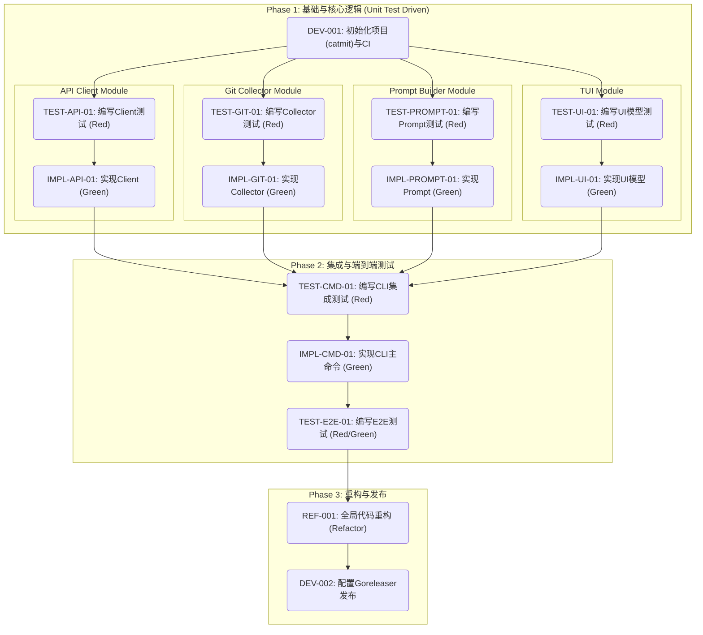

### **第一部分：测试策略概览**

*   **测试金字塔设计:**
    *   **单元测试 (Unit Tests, ~70%):** 这是测试的基石。我们将为每个独立的Go包 (`collector`, `prompt`, `client`, `ui`) 编写详尽的单元测试。使用Mock技术隔离外部依赖（如文件系统、`git`命令执行、HTTP API）。`ui`包的测试将重点验证 `Bubble Tea` 模型的更新逻辑和状态转换，而非终端渲染。
    *   **集成测试 (Integration Tests, ~20%):** 测试模块间的协作。关键集成点包括：
        1.  CLI (`cmd`) 与核心逻辑包 (`collector`, `prompt`, `client`) 的集成。
        2.  `collector` 模块与真实 `git` 命令的交互（在受控的临时Git仓库中进行）。
        3.  主程序与模拟的DeepSeek API服务器 (`httptest.Server`) 的交互。
    *   **端到端测试 (E2E Tests, ~10%):** 将编译好的 `catmit` 二进制文件作为一个黑盒进行测试。通过脚本驱动CLI，在预设的Git仓库环境中验证完整的用户流程，包括参数解析、API交互（使用Mock服务器）、Git提交以及退出码的正确性。

*   **测试框架与工具选择:**
    *   **核心框架:** Go 1.22 内置的 `testing` 包。
    *   **断言库:** `stretchr/testify/assert` 和 `stretchr/testify/require` 提供更流畅的断言API。
    *   **Mocking:** `stretchr/testify/mock` 用于模拟接口。对于 `git` 命令执行，我们将通过接口注入的方式进行Mock。
    *   **HTTP测试:** Go 内置的 `net/http/httptest` 包来创建Mock API服务器。
    *   **CLI测试:** `rogpeppe/go-internal/testscript` 或自定义的 `exec.Command` 包装器来执行和验证E2E测试。
    *   **Linter:** `golangci-lint` 用于静态代码分析，`commitlint` (通过Node.js/`npx`环境) 用于验证生成的commit message是否符合规范。

*   **测试覆盖率目标:**
    *   **核心逻辑包 (`prompt`, `client`):** > 90%
    *   **交互逻辑包 (`collector`, `ui`):** > 85%
    *   **项目整体:** > 80%
    *   CI流水线将强制执行覆盖率检查。

*   **关键测试场景:**
    1.  **Happy Path:** 成功生成并接受/自动提交一条符合规范的英文commit。
    2.  **参数验证:** `--lang`, `--timeout`, `--yes`, `--dry-run` 的行为符合预期。
    3.  **TUI交互:** 验证 `Accept`, `Edit`, `Cancel` 选项能正确驱动程序状态。
    4.  **错误处理:** 无diff、Git命令失败、API密钥缺失、API超时、API返回错误码（4xx/5xx）、commit失败等场景。
    5.  **边界条件:** 超大diff的截断逻辑。

---

### **第二部分：TDD结构化任务列表 (任务总览)**

| 任务ID       | 任务名称                                               | 所属功能/模块 | 任务类型                 | TDD阶段    | 任务描述                                                                   | 完成标准/验证方法                                                              | 前置依赖         | 预期输出/交付物                       | 复杂度 | 测试覆盖要求 |
|--------------|--------------------------------------------------------|---------------|--------------------------|------------|----------------------------------------------------------------------------|--------------------------------------------------------------------------------|------------------|---------------------------------------|----------|--------------|
| **DEV-001**  | 初始化Go项目(catmit)与CI/CD配置                        | DevOps        | `DevOps`                 | N/A        | `go mod init github.com/penwyp/catmit`，配置`.github/workflows`，集成`golangci-lint`和`go test`。 | CI流水线在代码推送时能成功运行`lint`和`test`。                                   | -                | `go.mod`, `.github/`目录结构          | S        | N/A          |
| **TEST-API-01**| 编写DeepSeek Client的单元测试(成功、错误、超时)          | `client`      | `Test-Implementation`    | Red        | 使用`httptest`模拟API。测试正常200响应、4xx/5xx错误响应和请求超时场景。    | 测试用例覆盖所有场景并通过。`go test ./client -v`。                              | DEV-001          | `client/client_test.go`               | M        | 95%          |
| **IMPL-API-01**| 实现DeepSeek Client                                    | `client`      | `Feature-Implementation` | Green      | 实现与DeepSeek API交互的客户端，处理请求构建、响应解析、错误和超时。         | `TEST-API-01` 中的所有测试用例通过。                                             | TEST-API-01      | `client/client.go`                    | M        | N/A          |
| **TEST-GIT-01**| 编写Git Collector的单元测试                              | `collector`   | `Test-Implementation`    | Red        | Mock `git`命令执行接口，测试获取最近10条commit和staged/unstaged diff的逻辑。 | 测试用例覆盖正常和无diff场景。`go test ./collector -v`。                       | DEV-001          | `collector/collector_test.go`         | M        | 90%          |
| **IMPL-GIT-01**| 实现Git Collector                                      | `collector`   | `Feature-Implementation` | Green      | 实现调用`git`命令并解析其输出的逻辑。                                      | `TEST-GIT-01` 中的所有测试用例通过。                                             | TEST-GIT-01      | `collector/collector.go`              | M        | N/A          |
| **TEST-PROMPT-01**| 编写Prompt构建器的单元测试                             | `prompt`      | `Test-Implementation`    | Red        | 测试prompt模板渲染、语言指令注入以及超长diff的中间截断逻辑。               | 测试用例覆盖所有场景，特别是截断逻辑。`go test ./prompt -v`。                  | DEV-001          | `prompt/prompt_test.go`               | S        | 95%          |
| **IMPL-PROMPT-01**| 实现Prompt构建器                                      | `prompt`      | `Feature-Implementation` | Green      | 根据输入（diff, log, lang）构建最终发送给LLM的prompt。                       | `TEST-PROMPT-01` 中的所有测试用例通过。                                            | TEST-PROMPT-01   | `prompt/prompt.go`                    | S        | N/A          |
| **TEST-UI-01** | 编写TUI状态模型的单元测试                              | `ui`          | `Test-Implementation`    | Red        | 测试`Bubble Tea`模型在不同事件（API调用、成功、失败、用户按键）下的状态转换。 | 验证模型状态（如`isLoading`, `isDone`）按预期改变。`go test ./ui -v`。         | DEV-001          | `ui/model_test.go`                    | L        | 85%          |
| **IMPL-UI-01** | 实现TUI交互界面与状态逻辑                              | `ui`          | `Feature-Implementation` | Green      | 使用`Bubble Tea`实现Spinner、进度条和Review界面的视图及更新逻辑。          | `TEST-UI-01` 中的所有测试用例通过。                                             | TEST-UI-01       | `ui/model.go`, `ui/view.go`           | L        | N/A          |
| **TEST-CMD-01**| 编写CLI命令的集成测试                                  | `cmd`         | `Test-Implementation`    | Red        | 测试flag解析（`-y`, `-l`, `--dry-run`等）及主逻辑流程（调用各模块）。       | Mock核心模块接口，验证不同flag组合下程序的行为是否正确。`go test ./cmd -v`。 | IMPL-API-01, IMPL-GIT-01, IMPL-PROMPT-01 | `cmd/root_test.go`                    | L        | N/A          |
| **IMPL-CMD-01**| 实现Cobra根命令并集成所有模块                          | `cmd`         | `Feature-Implementation` | Green      | 编写`main.go`和`cmd/root.go`，将所有模块（client, collector, prompt, ui）组装。 | `TEST-CMD-01` 中的所有测试用例通过。                                             | TEST-CMD-01      | `main.go`, `cmd/root.go`              | M        | N/A          |
| **TEST-E2E-01**| 编写E2E测试脚本 (Happy Path, --yes, --dry-run)           | E2E           | `Test-Implementation`    | Red        | 运行编译后的二进制文件，在临时Git仓库中测试`--yes`和`--dry-run`等核心流程。  | 脚本成功执行，输出符合预期，`--yes`能生成符合`commitlint`规范的commit。         | IMPL-CMD-01      | `test/e2e/e2e_test.go`                | L        | N/A          |
| **REF-001**  | 全局代码重构与优化                                     | `core`        | `Refactoring`            | Refactor   | 根据`golangci-lint`建议和代码审查反馈进行重构，优化可读性和性能。          | 所有现有测试通过，lint无警告，代码质量提升。                                   | TEST-E2E-01      | 全局代码库                            | M        | N/A          |
| **DEV-002**  | 配置Goreleaser进行自动化发布                           | DevOps        | `DevOps`                 | N/A        | 创建`.goreleaser.yml`，配置交叉编译（macOS/Linux, amd64/arm64）和GitHub Release。 | 在打tag时，CI能自动构建二进制文件并创建Release。                               | REF-001          | `.goreleaser.yml`                     | M        | N/A          |

---

### **第三部分：详细任务定义 (JSON数组 - 自动化处理源文件)**

```json
[
  {
    "task_id": "TEST-API-01",
    "module": "client",
    "description": "编写DeepSeek Client的单元测试(成功、错误、超时)",
    "task_type": "Test-Implementation",
    "tdd_phase": "Red",
    "dependencies": ["DEV-001"],
    "complexity": "M",
    "deliverables": ["client/client_test.go"],
    "test_spec": {
      "test_framework": "Go testing + testify/assert + httptest",
      "test_cases": [
        {
          "name": "test_successful_completion",
          "description": "验证正常调用API并成功返回commit message",
          "input": {"prompt": "test prompt", "apiKey": "valid_key"},
          "mock_server_response": {"status": 200, "body": "{\"choices\":[{\"message\":{\"content\":\"feat: test commit\"}}]}"},
          "expected_output": {"message": "feat: test commit", "error": null}
        },
        {
          "name": "test_api_key_error",
          "description": "验证API返回401 Unauthorized错误",
          "input": {"prompt": "test prompt", "apiKey": "invalid_key"},
          "mock_server_response": {"status": 401, "body": "{\"error\": \"Invalid API Key\"}"},
          "expected_output": {"message": "", "error": "API error: status 401 - {\"error\": \"Invalid API Key\"}"}
        },
        {
          "name": "test_request_timeout",
          "description": "验证客户端请求超时逻辑",
          "input": {"prompt": "test prompt", "apiKey": "valid_key", "timeout": "10ms"},
          "mock_server_response": {"delay": "20ms"},
          "expected_output": {"message": "", "error": "context deadline exceeded"}
        }
      ],
      "coverage_target": 95
    },
    "verification": {
      "method": "Automated Test Execution",
      "criteria": "All test cases pass with 0 failures, and test coverage meets the target.",
      "command": "go test -coverprofile=coverage.out ./client && go tool cover -func=coverage.out"
    },
    "notes": "使用httptest.NewServer创建mock服务器，并通过context.WithTimeout控制超时。"
  },
  {
    "task_id": "IMPL-API-01",
    "module": "client",
    "description": "实现DeepSeek Client",
    "task_type": "Feature-Implementation",
    "tdd_phase": "Green",
    "dependencies": ["TEST-API-01"],
    "complexity": "M",
    "deliverables": ["client/client.go"],
    "spec": {
      "function_signature": "func (c *Client) GetCommitMessage(ctx context.Context, prompt string) (string, error)",
      "input": "context with timeout, prompt string",
      "output": "commit message string, error"
    },
    "verification": {
      "method": "Unit Test Pass",
      "criteria": "TEST-API-01中定义的所有测试用例必须通过",
      "command": "go test ./client -v"
    },
    "notes": "优先实现最简代码使测试通过。错误处理要清晰，包含HTTP状态码和响应体。"
  },
  {
    "task_id": "TEST-E2E-01",
    "module": "E2E",
    "description": "编写E2E测试脚本 (Happy Path, --yes, --dry-run)",
    "task_type": "Test-Implementation",
    "tdd_phase": "Red",
    "dependencies": ["IMPL-CMD-01"],
    "complexity": "L",
    "deliverables": ["test/e2e/e2e_test.go"],
    "test_spec": {
      "test_framework": "Go testing + exec.Command",
      "test_cases": [
        {
          "name": "test_e2e_happy_path_with_yes_flag",
          "description": "验证`catmit -y`在有staged change时能自动生成并提交commit",
          "setup": "创建一个临时git仓库，添加并stage一个文件，启动mock API服务器。",
          "command": "./catmit -y",
          "expected_output": {
            "stdout_contains": "Committing...",
            "exit_code": 0,
            "git_log_check": "最新一条commit message符合Conventional Commit规范"
          }
        },
        {
          "name": "test_e2e_dry_run_flag",
          "description": "验证`catmit --dry-run`只打印消息而不提交",
          "setup": "同上",
          "command": "./catmit --dry-run",
          "expected_output": {
            "stdout_contains": "feat(test): add new file",
            "exit_code": 0,
            "git_log_check": "没有新的commit被创建"
          }
        },
        {
          "name": "test_e2e_timeout_flag",
          "description": "验证`catmit -t 1`在API响应慢时会超时退出",
          "setup": "同上，但mock API服务器设置为2秒后响应",
          "command": "./catmit -t 1",
          "expected_output": {
            "stderr_contains": "Timeout (1 s) exceeded",
            "exit_code": 124
          }
        }
      ],
      "coverage_target": null
    },
    "verification": {
      "method": "Automated Test Execution",
      "criteria": "在CI环境中，所有E2E测试场景通过。",
      "command": "go test ./test/e2e -v"
    },
    "notes": "E2E测试需要管理好测试环境的创建和清理，确保测试的幂等性。"
  }
]
```

---

### **第四部分：TDD任务依赖关系图 (Mermaid)**

