# TUI Flow Documentation

This document describes the complete TUI (Terminal User Interface) flow for catmit, based on the MainModel implementation.

## Overview

The catmit TUI uses a unified state machine approach with the `MainModel` managing the entire lifecycle through distinct phases and sub-stages. The implementation leverages Bubble Tea framework with Alt Screen mode for clean terminal handling.

## Architecture

```
MainModel
├── Phase Management (PhaseLoading → PhaseReview → PhaseCommit → PhaseDone)
├── Loading Stages (StageCollect → StagePreprocess → StagePrompt → StageQuery)
├── Commit Stages (CommitStageInit → CommitStageCommitting → CommitStageCommitted → CommitStagePushing → CommitStageDone)
└── User Interactions (Accept/Edit/Cancel with keyboard shortcuts)
```

## Complete Flow Diagram

```mermaid
graph TB
    Start([Program Start]) --> Init[MainModel.Init]
    Init --> LoadingPhase[PhaseLoading]
    
    %% Loading Phase Flow
    LoadingPhase --> StageCollect[StageCollect: Collecting diff...]
    StageCollect --> CollectCmd[collectCmd: Git operations]
    CollectCmd --> DiffCollected{diffCollectedMsg}
    DiffCollected --> StagePreprocess[StagePreprocess: Preprocessing files...]
    StagePreprocess --> PreprocessCmd[preprocessCmd: File status summary]
    PreprocessCmd --> PreprocessDone{preprocessDoneMsg}
    PreprocessDone --> StagePrompt[StagePrompt: Crafting prompt...]
    StagePrompt --> BuildPromptCmd[buildSmartPromptCmd: Token budget control]
    BuildPromptCmd --> PromptBuilt{smartPromptBuiltMsg}
    PromptBuilt --> StageQuery[StageQuery: Generating commit message...]
    StageQuery --> QueryCmd[queryCmd: LLM API call]
    QueryCmd --> QueryDone{queryDoneMsg}
    QueryDone --> ReviewPhase[PhaseReview]
    
    %% Review Phase Flow
    ReviewPhase --> ReviewDisplay[Display commit message]
    ReviewDisplay --> UserInput{User Input}
    
    %% User Input Handling
    UserInput --> |A/Accept| AcceptFlow[reviewDecision = DecisionAccept]
    UserInput --> |E/Edit| EditFlow[editing = true]
    UserInput --> |C/Cancel/Esc| CancelFlow[reviewDecision = DecisionCancel]
    UserInput --> |Arrow Keys| NavigateButtons[Navigate between buttons]
    UserInput --> |Enter| ButtonAction{selectedButton}
    UserInput --> |Ctrl+C| CtrlCCancel[err = context.Canceled]
    
    %% Button Actions
    ButtonAction --> |buttonAccept| AcceptFlow
    ButtonAction --> |buttonEdit| EditFlow
    ButtonAction --> |buttonCancel| CancelFlow
    
    %% Edit Flow
    EditFlow --> EditMode[Show textarea editor]
    EditMode --> EditInput{Edit Input}
    EditInput --> |Ctrl+S| SaveEdit[Save edited message]
    EditInput --> |Esc| CancelEdit[Cancel editing]
    EditInput --> |Text Input| UpdateText[Update textarea]
    SaveEdit --> ReviewDisplay
    CancelEdit --> ReviewDisplay
    UpdateText --> EditMode
    
    %% Accept Flow
    AcceptFlow --> CommitPhase[PhaseCommit]
    CommitPhase --> CommitStageInit[CommitStageInit]
    CommitStageInit --> CommitStageCommitting[CommitStageCommitting: Committing changes...]
    CommitStageCommitting --> StartCommit[startCommit: Check staging & commit]
    StartCommit --> CommitDone{commitDoneMsg}
    
    %% Commit Flow
    CommitDone --> |Success| CommitStageCommitted[CommitStageCommitted: ✓ Committed successfully]
    CommitDone --> |Error| CommitError[Set error & quit]
    
    %% Push Flow Decision
    CommitStageCommitted --> PushDecision{enablePush?}
    PushDecision --> |Yes| CommitStagePushing[CommitStagePushing: Pushing to remote...]
    PushDecision --> |No| CommitStageDone[CommitStageDone: ✓ Committed successfully]
    
    %% Push Flow
    CommitStagePushing --> StartPush[startPush: Push to remote]
    StartPush --> PushDone{pushDoneMsg}
    PushDone --> |Success| PushSuccess[CommitStageDone: ✓ Pushed successfully]
    PushDone --> |Error| PushFailed[CommitStagePushFailed: ✗ Push failed]
    
    %% Final States
    CommitStageDone --> FinalTimeout[finalTimeoutMsg: Show success for 1.5s]
    PushSuccess --> FinalTimeout
    PushFailed --> FinalTimeoutLong[finalTimeoutMsg: Show error for 3s]
    
    %% Exit Conditions
    FinalTimeout --> ExitSuccess[done = true & tea.Quit]
    FinalTimeoutLong --> ExitSuccess
    CancelFlow --> ExitCancel[done = true & tea.Quit]
    CtrlCCancel --> ExitCancel
    CommitError --> ExitError[done = true & tea.Quit]
    
    %% Error Handling
    CollectCmd --> |Error| ErrorMsg{errorMsg}
    PreprocessCmd --> |Error| ErrorMsg
    BuildPromptCmd --> |Error| ErrorMsg
    QueryCmd --> |Error| ErrorMsg
    ErrorMsg --> ExitError
    
    %% Phase Transitions
    NavigateButtons --> ReviewDisplay
    
    %% Styling
    classDef phaseStyle fill:#e1f5fe,stroke:#0277bd,stroke-width:2px
    classDef stageStyle fill:#f3e5f5,stroke:#7b1fa2,stroke-width:2px
    classDef messageStyle fill:#fff3e0,stroke:#f57c00,stroke-width:2px
    classDef decisionStyle fill:#e8f5e8,stroke:#388e3c,stroke-width:2px
    classDef errorStyle fill:#ffebee,stroke:#d32f2f,stroke-width:2px
    classDef exitStyle fill:#fafafa,stroke:#616161,stroke-width:2px
    
    class LoadingPhase,ReviewPhase,CommitPhase phaseStyle
    class StageCollect,StagePreprocess,StagePrompt,StageQuery,CommitStageInit,CommitStageCommitting,CommitStageCommitted,CommitStagePushing,CommitStageDone stageStyle
    class DiffCollected,PreprocessDone,PromptBuilt,QueryDone,CommitDone,PushDone,FinalTimeout,FinalTimeoutLong messageStyle
    class UserInput,ButtonAction,EditInput,PushDecision decisionStyle
    class ErrorMsg,CommitError,PushFailed errorStyle
    class ExitSuccess,ExitCancel,ExitError exitStyle
```



## Phase Descriptions

### 1. Loading Phase (PhaseLoading)

The loading phase handles all data collection and LLM interaction:

- **StageCollect**: Collect git diff and repository information
- **StagePreprocess**: Process file status summaries and prepare data
- **StagePrompt**: Build intelligent prompts with token budget management
- **StageQuery**: Make LLM API calls to generate commit messages

**Key Messages**:
- `diffCollectedMsg`: Transition to preprocessing
- `preprocessDoneMsg`: Transition to prompt building
- `smartPromptBuiltMsg`: Transition to LLM query
- `queryDoneMsg`: Transition to review phase

### 2. Review Phase (PhaseReview)

The review phase allows users to interact with the generated commit message:

**Display Modes**:
- **Normal Mode**: Show commit message with Accept/Edit/Cancel buttons
- **Edit Mode**: Show textarea editor for message modification

**User Interactions**:
- **Keyboard Shortcuts**: `A` (Accept), `E` (Edit), `C` (Cancel)
- **Arrow Keys**: Navigate between buttons
- **Enter**: Activate selected button
- **Ctrl+C**: Cancel at any time

**Edit Mode Controls**:
- **Ctrl+S**: Save edited message
- **Esc**: Cancel editing
- **Text Input**: Real-time message modification

### 3. Commit Phase (PhaseCommit)

The commit phase handles the actual git operations:

- **CommitStageInit**: Initialize commit process
- **CommitStageCommitting**: Execute git commit (with optional staging)
- **CommitStageCommitted**: Commit successful, decide on push
- **CommitStagePushing**: Push to remote repository
- **CommitStageDone**: All operations completed

**Key Messages**:
- `commitDoneMsg`: Handle commit completion
- `pushDoneMsg`: Handle push completion
- `finalTimeoutMsg`: Trigger program exit

### 4. Error Handling

Comprehensive error handling throughout the flow:

- **Loading Errors**: Git operations, API failures, preprocessing errors
- **Commit Errors**: Staging failures, commit failures
- **Push Errors**: Remote push failures (non-fatal, commit still succeeds)
- **User Cancellation**: Ctrl+C handling at all stages

## Key Features

### Alt Screen Mode
- Uses `tea.WithAltScreen()` for clean terminal handling
- Prevents TUI content from remaining in terminal history
- Automatically clears on program exit

### Responsive Design
- Terminal size awareness with `tea.WindowSizeMsg`
- Dynamic content width calculation
- Adaptive text wrapping and truncation

### State Management
- Clear separation between phases and sub-stages
- Atomic state transitions
- Proper cleanup on all exit conditions

### User Experience
- Visual feedback with spinners and progress indicators
- Consistent styling and layout
- Keyboard shortcuts for efficient operation
- Edit mode for commit message refinement

## Implementation Details

### MainModel Structure
```go
type MainModel struct {
    // State management
    phase          Phase
    loadingStage   Stage
    reviewDecision Decision
    commitStage    CommitStage
    
    // UI components
    spinner        spinner.Model
    textArea       textarea.Model
    selectedButton buttonState
    editing        bool
    
    // Configuration
    enablePush     bool
    stageAll       bool
    apiTimeout     time.Duration
    
    // ... other fields
}
```

### Message Types
- **Stage Transitions**: `diffCollectedMsg`, `preprocessDoneMsg`, `smartPromptBuiltMsg`, `queryDoneMsg`
- **Operation Results**: `commitDoneMsg`, `pushDoneMsg`
- **Timing**: `finalTimeoutMsg`
- **Errors**: `errorMsg`

### Exit Conditions
- **Success**: Normal completion (`done = true`)
- **Cancel**: User cancellation (`reviewDecision = DecisionCancel`)
- **Error**: Various error conditions with appropriate cleanup
- **Timeout**: Automatic exit after displaying final states

## Testing Considerations

- Mock all external dependencies (git, LLM API)
- Test phase transitions and state management
- Verify error handling paths
- Test user interaction flows
- Validate terminal size responsiveness